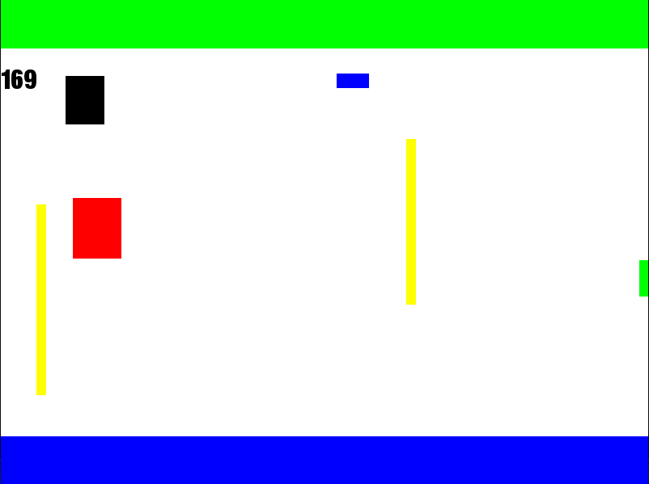

# Sky Surfer

Sky Surfer is a 2D game built with SFML in C#. In this game, players control a character that runs endlessly by flying or while being under power up, by jumping or sticking to walls while avoiding obstacles and killing or dodging ennemies to achieve a high score.

## Getting Started

To run the game, you'll need to have SFML installed on your system. You can find instructions on how to download and install SFML [here](https://www.sfml-dev.org/download.php). 

Once you have SFML installed, you can clone the repository and open the solution file (`SkySufer.sln`) in your IDE of choice.

## Gameplay

In Sky Suffer, players control a character that runs automatically across platforms in the sky. The player can fly or not to avoid obstacles. The goal is to achieve a high score by surviving as long as possible.

The game features a simple control scheme:

By default:
- Use the `Z` key to fly, jump or switch wall
- Use the `Space` key to shoot the ennemies

## Credits

Sky Runner was created by VERNET Benjamin and DURA Jeremy, both in B2 at Ynov Lyon school. Special thanks to the following resources:

- SFML - Simple and Fast Multimedia Library

## License

This project is free to use and to share, there is no license on it.
